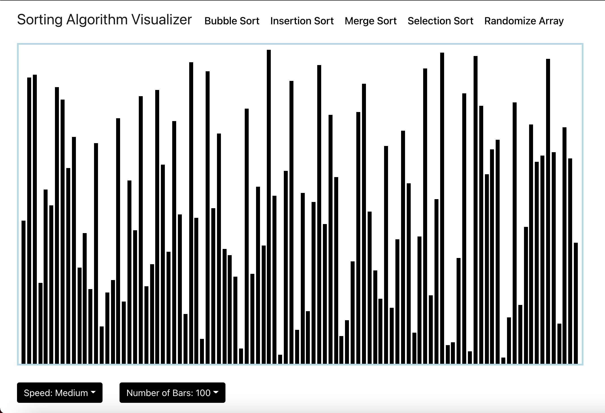
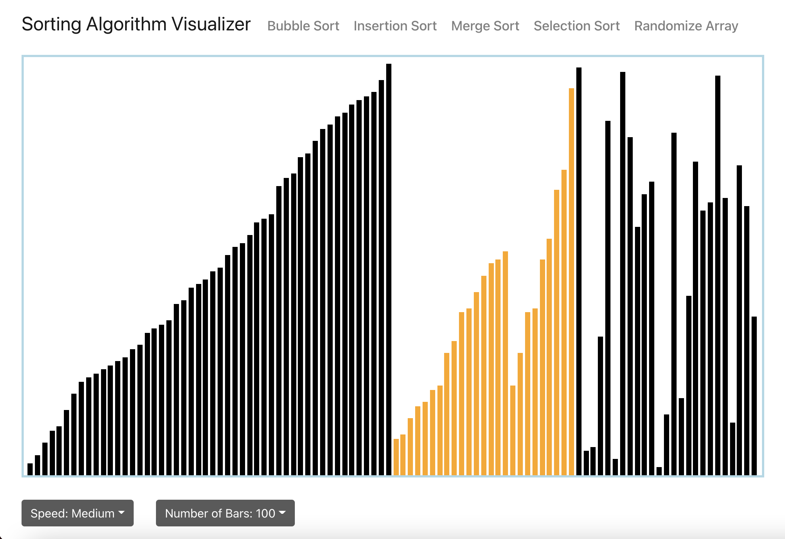
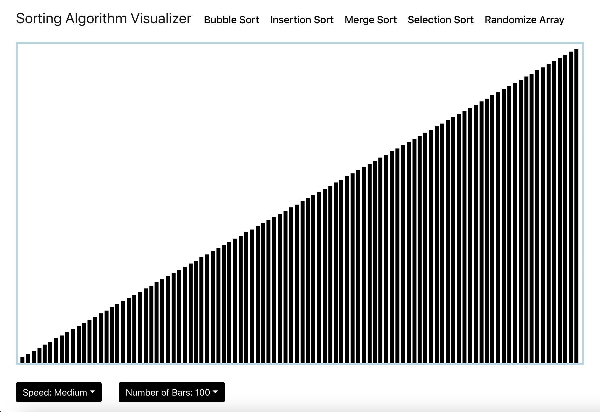

# Sorting Algorithm Visualizer

This project is a sorting algorithm visualizer. An array is represented as vertical bars along the screen. Users are able to randomize the array and choose from different algorithms to sort the array. The visualizations were created by using pure HTML, CSS, and JavaScript.  The purpose of this project was to test my knowledge of sorting algorithms and to create an animation.  For the merge sort algorithm, I used pseudocode from Introduction to Alogorithms (Third Edition).

### Algorithms Include
- Selection Sort
    - Upper Bound: O(n2)
    - Lower Bound: Ω(n2)
- Bubble Sort
    - Upper Bound: O(n2)
    - Lower Bound: Ω(n)
- Merge Sort
    - Upper Bound: O(n log n)
    - Lower Bound: O(n log n)

### Technology Used
This application is purely front-end, built using React. 

### Installation
1. Download directory.
2. In directory, run "yarn start" to run the application in development.

### Next Steps

- Include additional sorting algorithms such as insertion sort and quick sort.
- Include features to allow user to change size of array and change speed of sorting.
- Make application responsive.
- Adjust merge sort visualization to appear more elegant.

### Preview

 

 

 

 
